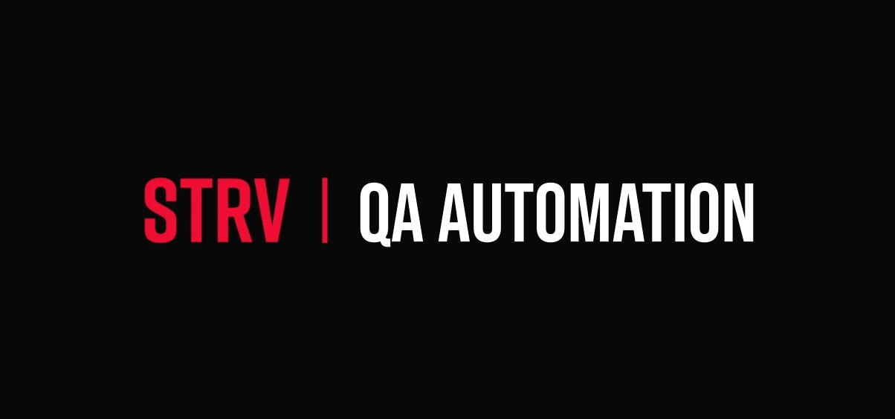

# RealWorld Playwright Demo

> End-to-end test automation portfolio project. **This branch (`main`) contains only the application under test** — a RealWorld (Conduit) clone. The Playwright + TypeScript test framework is built up progressively in sibling branches.



## About this repository

This project demonstrates how to build a scalable, maintainable end-to-end test automation framework **from scratch** using Playwright + TypeScript against a realistic full-stack web application.

The application under test is an implementation of the [RealWorld spec](https://github.com/gothinkster/realworld) — a fully functional Medium.com clone ("Conduit") with authentication, articles CRUD, comments, follows, favorites, and user profiles. It's built on Next.js 14 + tRPC + Prisma + SQLite.

See [APPLICATION.md](./APPLICATION.md) for the full application architecture.

## Branch strategy

This repo follows a deliberately linear branch narrative so the project can be reviewed as a sequence of pull requests, each representing a distinct phase of building the framework:

| Branch | What's in it |
|---|---|
| `main` | Application under test only — no E2E framework yet. *You are here.* |
| `setup/playwright` | Playwright infrastructure: config, fixtures, helpers, env, Allure, GitHub Actions. No spec files yet — framework runs "empty". |
| `tests/e2e-suite` | Actual specs (auth, articles, profile) using the framework from the setup branch. |
| `dev` | Stable integration branch. Flake hardening, final documentation polish. |

Each branch opens a pull request into its parent. The PRs themselves are part of the demonstration — they show the evolution of the project as discrete, reviewable units of work.

## Running the application

### Prerequisites

- Node.js 18 or higher
- npm (bundled with Node)

### Install & run

```bash
npm install      # installs deps, seeds database, generates Prisma client
npm run dev      # starts the app on http://localhost:3000
```

`npm install` automatically runs `postinstall` which:
1. Copies `.env.example` → `.env` if it doesn't exist.
2. Copies `prisma/base.sqlite` → `prisma/database.sqlite` (seed data).
3. Generates the Prisma client.
4. Applies the Prisma schema to the database.

### Available scripts

| Script | Purpose |
|---|---|
| `npm run dev` | Start the development server (`localhost:3000`) |
| `npm run build` | Production build |
| `npm run start` | Start the production server (requires `build` first) |
| `npm run lint` | Run ESLint |
| `npm run initialize:fresh` | Reset `.env` and database back to seed state |

The `test:run` and `test:initialize:database` scripts are placeholders from the upstream template. They will be replaced with real Playwright commands in the `setup/playwright` branch.

## What to look at in this repo

If you're evaluating this project as a portfolio piece:

1. **Start here** (`main`) — to understand the application under test.
2. **Switch to `setup/playwright`** — to see how the test framework is wired up: config, fixtures, env validation, reporting, CI.
3. **Switch to `tests/e2e-suite`** — to see the actual Page Objects and specs.
4. **Switch to `dev`** — to see the stabilized, production-ready state.

Reading the pull requests in order (main → setup/playwright → tests → dev) is the recommended way to understand the architecture decisions that went into the project.

## License

MIT — see [LICENSE](./LICENSE).
